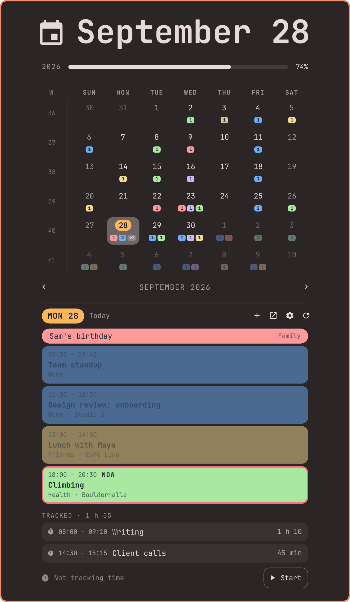
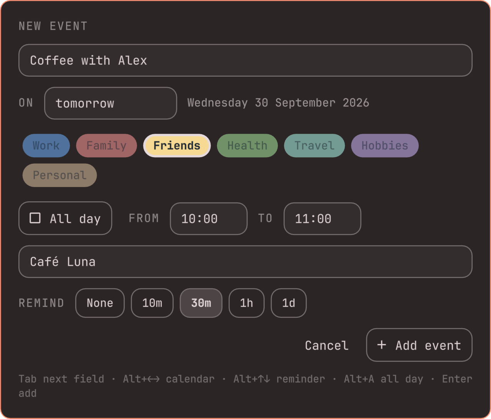
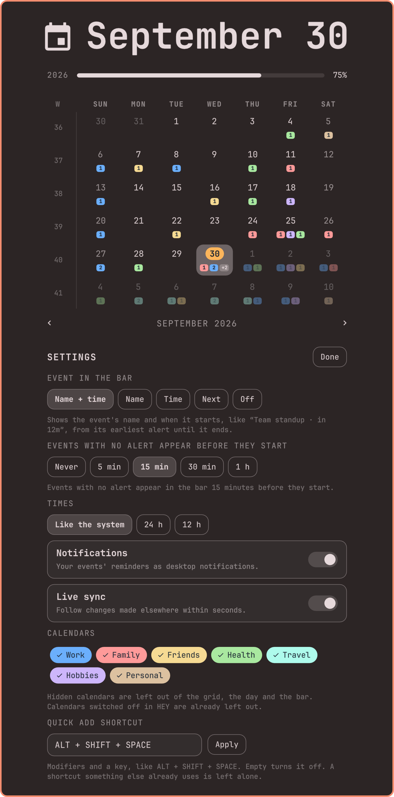
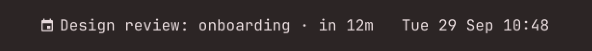

# OmaCal

Omarchy's stock clock and calendar, exactly as it ships, with your calendar
laid over it. [HEY](https://hey.com) is the first calendar it reads; others
plug in as backends (see [Backends](#backends)).



- **Chips under every day.** One chip per calendar color, with the number of
  that day's events in it. A day with a Work meeting and a dinner shows a
  blue `1` and a red `1`. More than three colors collapse into `+N`. Hover a
  day for its events.
- **Click a day to see it.** The day view under the grid draws the day the
  way HEY does: all-day pills, then a pastel block per event with its time,
  calendar and location. The event under way is ringed and marked `NOW`.
  Clicking an event opens its meeting link, or the event in HEY.
- **New events.** `+`, `N`, or double-clicking a day opens a quick form:
  title, day, calendar, all-day or a time range, place, reminder. Days and
  times are typed loosely: `fri`, `tomorrow`, `next mon`, `3 oct` for the
  day, `9`, `930`, `9:30pm`, `21.30` for times. An end before the start
  means the next morning.
- **Quick add from anywhere.** **Alt+Shift+Space** opens the same form as a
  card in the middle of the screen, like OmaTasks' quick add. The shortcut
  is bound in Hyprland by the plugin, never over one that is already taken,
  and released when the plugin unloads.
- **Delete** a one-off event from its hover button (with a confirmation).
  Repeating events are left to HEY, since deleting by id takes the series.
- **Notifications.** The reminders you set in HEY arrive as desktop
  notifications, once each however many monitors you have, with a small
  calendar page in the event's calendar colour as the icon. Clicking one
  opens the meeting link or the event.
- **Time tracking** (HEY). Start and stop HEY's time tracker from today's view.
  Finished tracks show on their day under **Tracked**, with the day's
  total. Stopping one opens its name field right away; any track can be
  renamed by clicking it (HEY names a track by its category, created if
  new) or deleted from its hover button.
- **Live sync.** HEY's `hey watch` stream refreshes the panel within seconds of
  a change made anywhere else, with polling as the fallback.
- **In the bar**, like a macOS menu-bar calendar: an event's name and when
  sit in front of the stock clock (`󰃭 Team standup · in 12m`, then
  `· until 14:30`) from its **earliest reminder** until it ends. A day
  ahead if you asked for a day's notice, 30 minutes if 30. Without
  reminders it uses `alertLeadMinutes`; all-day events only show when they
  have a reminder. When several overlap, the bar names one and counts the
  rest (`+2`), and hovering lists them all. What it names first: something
  starting within `alertLeadMinutes`, then what is under way (ending
  soonest first), then what is coming, then all-day events.
- **Today in HEY's orange**, in the grid as well as the day view, and a
  **Today** button (or `T`) back to it whenever you have moved away.

<p>
  
  
</p>



The screenshots are the real plugin with a made-up calendar
(`tools/render-screenshots`).

## Requirements

- Omarchy 4 with the Quattro shell plugin system
- For the HEY backend:
  - **hey-cli 1.3.0 or newer**, signed in (`hey setup`). 1.3.0 is the version
  Omarchy installs, so a stock system works as is.
  - `jq` (part of Omarchy)

### hey-cli versions

| hey-cli | How weeks are read | Notes |
| --- | --- | --- |
| 1.4.0 and newer | `hey event week`, HEY's own expansion | Exact. Calendars switched off in HEY are left out. |
| 1.3.x (Omarchy's package) | `hey event list`, expanded by the plugin | HEY's repeat presets (daily, weekdays, weekly, every other week, monthly, yearly, with "until" or a count) are expanded locally. A single occurrence edited or deleted in HEY is not visible. Every calendar is included; hide ones you switched off with `hiddenCalendars`. |
| older, or missing | nothing | The panel says so instead of showing empty days. |

The version is read once, from `hey --version`, when the shell starts.

## Install

Review the source first: Omarchy plugins run as unsandboxed code inside the
shell.

```bash
omarchy plugin add https://github.com/crmne/omacal.git --enable
omarchy plugin disable omarchy.clock
```

OmaCal replaces the stock clock, so the second line takes that one off the
bar. Point the bar's center anchor at OmaCal so the center section stays put
when hover-only widgets appear:

```jsonc
// ~/.config/omarchy/shell.json
{ "bar": { "centerAnchor": "crmne.omacal" } }
```

Update with `omarchy plugin update crmne.omacal`. Remove with
`omarchy plugin remove crmne.omacal`, then `omarchy plugin enable
omarchy.clock` and set `centerAnchor` back to `omarchy.clock`. Removing it
touches nothing in your calendar.

## What it runs

Everything goes through the backend's command-line tool; OmaCal makes no
network requests of its own and stores no credentials. For HEY:
`hey event week` or `hey event list`, `hey calendar list`, `hey event add`
and `delete`, `hey timetrack`, and a long-running `hey watch` for live
sync. Every call is bounded by `timeout` and `head -c`, and takes its input
as arguments, never as shell text. Event text is length-capped and drawn as
plain text, and only `https` links are handed to `xdg-open`. It also runs
`notify-send` for reminders and `hyprctl` to bind the quick-add shortcut.

## Keys

### New-event form (panel and quick add)

The form never needs the mouse. A hint line under it says what the keys do
where the focus is.

| Key | Does |
| --- | --- |
| `Tab` / `Shift+Tab` | Next / previous field, the calendar and reminder rows included |
| `←` `→` | On the calendar row: switch calendar. On the reminder row: switch reminder. On all day: toggle |
| `↑` `↓` | In a time: 15 minutes earlier or later. In the day: a day (`Shift`: a week) |
| `Alt+←` `Alt+→` | Switch calendar, from any field |
| `Alt+↑` `Alt+↓` | Switch reminder, from any field |
| `Alt+A` | Toggle all day, from any field |
| `Enter` | Add the event |
| `Esc` | Cancel |

### Calendar panel

The stock ones all work: arrows, `[` `]` months, `{` `}` years, `T` today,
`W` week start. Added:

| Key | Does |
| --- | --- |
| `,` `.` | Previous / next day |
| `<` `>` | Previous / next week |
| `N` | New event on the selected day |
| `S` | Settings |
| `O` | Open the selected day in HEY |
| `R` | Refresh from HEY |

## Settings

The gear button in the panel (or `S`) opens the settings, right under the
calendar. Omarchy does not draw settings screens for plugin widgets yet, so
they live there. Tab walks them, arrows pick, Enter applies, Esc goes back.
Each change is saved to the widget's entry in `~/.config/omarchy/shell.json`
at once, so it can be edited there too.

| Key | Default | Meaning |
| --- | --- | --- |
| `barEvent` | `soon` | `soon`: name an event in the bar from its earliest reminder until it ends. `name`: the same, but only the title. `time`: the same, but only when (`in 12m`). `next`: always name today's next event. `off`: the glyph only. |
| `notifications` | `true` | Show HEY reminders as notifications. |
| `quickAddShortcut` | `ALT + SHIFT + SPACE` | Opens the quick-add card. Empty turns it off. |
| `alertLeadMinutes` | `15` | How early the bar names an event that has no reminders, and what counts as "about to start". |
| `timeFormat` | `auto` | `auto`, `12` or `24`. |
| `liveSync` | `true` | Keep a `hey watch` running for instant updates. |
| `refreshIntervalSec` | `300` | Polling fallback, 30 to 3600. |
| `hiddenCalendars` | `""` | Comma-separated calendar names to leave out. |

The panel also stores `weekStartDay`, `birthYear`, `lifeExpectancy` (stock)
and `lastCalendarId` (the calendar the last new event went on).

## Not yet

HEY's day titles, photos and "Sometime this week" are not exposed by
hey-cli, so they are not here yet. Day titles are in HEY's API
(`Calendar::DayTitle`), and are the first candidate for a hey-cli addition.

## Backends

A backend is one file in `backends/`: the command lines that read and write
a calendar service, a probe that says whether (and how) it can run, and the
capabilities it has (`create`, `delete`, `watch`, `timeTracking`,
`dayLink`). The panel hides what a backend cannot do.

Backends never parse. Every command prints the standard JSON shapes
documented at the top of `Calendar.js` (events per week or per span,
calendars, time tracks), so everything after the command is shared: the
grid, the day view, repeats, the bar, reminders and notifications. Colors
can be HEY's color names or `#rrggbb`. `backends/Hey.js` is the reference;
CalDAV through `khal`, Google through `gcalcli`, and plain `.ics` files are
the natural next ones.

## Develop

```bash
tests/run                  # Calendar.js and the HEY backend, in five timezones
omarchy plugin validate .
```

Plugin code under `~/.config/omarchy/plugins` hot-reloads on save, but not
through a symlink: when developing from a linked checkout, load changes with
`omarchy-restart-shell`. `omarchy-shell shell toggle crmne.omacal` opens the
quick-add card; `omarchy-shell crmne.omacal open` the panel, and
`omarchy-shell crmne.omacal settings` its settings.

`Model.js` is Omarchy's and stays stock. `Calendar.js` holds the calendar
model, and `backends/` the services; both run under plain node.

## License

[MIT](LICENSE). Portions are Omarchy's own clock plugin, also MIT; see
[THIRD_PARTY_NOTICES.md](THIRD_PARTY_NOTICES.md).

OmaCal is an independent project, not created by, affiliated with, or
supported by HEY or 37signals.
